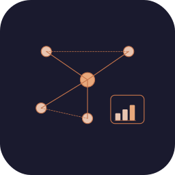

# MeshMonitor — Дополнение для Home Assistant

Дополнение для Home Assistant на основе [MeshMonitor](https://github.com/Yeraze/meshmonitor) — мощный дашборд и сервер виртуального узла для [Meshtastic](https://meshtastic.org) mesh-сетей.

## Возможности

- 📡 Подключение к ноде Meshtastic по TCP
- 🗺️ Карта с позициями узлов в реальном времени
- 📊 Телеметрия и статистика сети
- 🔌 **Сервер виртуального узла** — позволяет нескольким мобильным приложениям Meshtastic подключаться одновременно через порт `4404`
- 🏠 Поддержка Home Assistant Ingress (дашборд без лишних портов)
- 🔄 Сохранение данных между перезапусками

## Установка

### Установка в один клик

1. Нажми кнопку выше чтобы добавить репозиторий в Home Assistant
2. Перейди в **Настройки → Дополнения → Магазин дополнений**
3. Найди **MeshMonitor** и нажми **Установить**
4. Настрой дополнение (см. раздел Конфигурация)
5. Нажми **Запустить**

### Ручная установка

1. Перейди в **Настройки → Дополнения → Магазин дополнений**
2. Нажми три точки (⋮) в правом верхнем углу → **Репозитории**
3. Добавь: `https://github.com/BrainDeLook/meshmonitor-ha`
4. Найди **MeshMonitor** в магазине и установи

## Конфигурация

| Параметр | Описание | По умолчанию |
|----------|----------|--------------|
| `MESHTASTIC_NODE_IP` | IP адрес ноды Meshtastic | `192.168.1.231` |
| `MESHTASTIC_TCP_PORT` | TCP порт ноды | `4403` |
| `SESSION_SECRET` | Секретный ключ для сессий | — |
| `DISABLE_ANONYMOUS` | Требовать вход для просмотра | `false` |

## Сервер виртуального узла

Дополнение открывает порт **4404** как сервер виртуального узла. Это позволяет нескольким мобильным приложениям Meshtastic одновременно подключаться к одной ноде — чего сама нода не поддерживает.

Чтобы подключить мобильное приложение:

1. Открой приложение Meshtastic → Настройки → Подключение
2. Выбери **TCP**
3. Введи IP адрес Home Assistant и порт `4404`

## Благодарности

- [MeshMonitor](https://github.com/Yeraze/meshmonitor) от [@Yeraze](https://github.com/Yeraze)
- Дополнение вдохновлено [работой sgruber](https://git.sgruber.at/ha/addons)

## Лицензия

MIT
